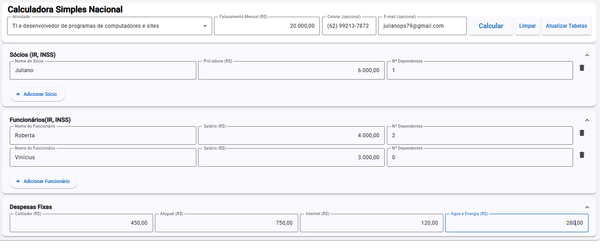
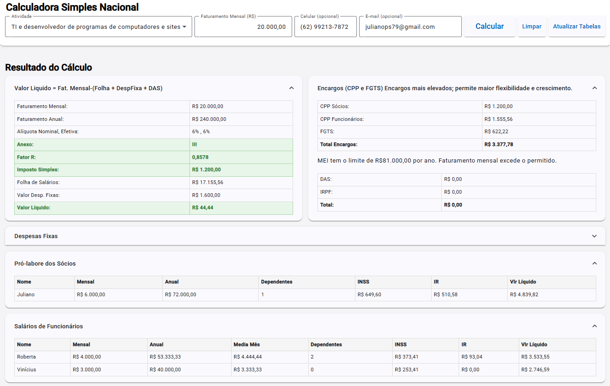

# 📊 API - Cálculo de Tributos Simples Nacional

API que calcula o DAS (Imposto Simples Nacional) para empresas do regime ME, com base nos Anexos III e V, considerando o enquadramento via Fator R, além do cálculo de INSS e IR para sócios (pró-labore) e funcionários (holerite).
---

## ✅ Funcionalidades

- ✔️ Calcula o DAS mensal com base no Fator R
- ✔️ Aponta qual Anexo (III ou V) será aplicado
- ✔️ Realiza cálculo de INSS e IR para funcionários e sócios
- ✔️ Simula custo mensal da empresa, incluindo folha, encargos e despesas fixas
- ✔️ Compara ME x MEI automaticamente
- ✔️ Possui Swagger com documentação completa
---

## 🛠️ Tecnologias Utilizadas

- ✅ C# (.NET 8)
- ✅ ASP.NET Web API
- ✅ Entity Framework Core
- ✅ PostgreSQL
- ✅ EF Migrations
- ✅ Swagger/OpenAPI
- ✅ Moq + xUnit (para testes)
- ✅ Reflection (para ocultar lógica sensível)
- ✅ Clean Architecture + SOLID + Object Calisthenics
- ➕ AutoMapper (mapeamento DTO ↔ Entidade)
- ➕ FluentValidation (validação de requisições via DTOs)
---

## 🧠 Diretrizes Arquiteturais

✔️ Clean Architecture: cada camada tem responsabilidade clara.
✔️ SOLID:
- SRP (responsabilidade única): cada classe tem um objetivo.
- DIP (injeção de dependência): serviços e controladores são injetados.
✔️ Object Calisthenics: código limpo, coeso e desacoplado.
✔️ Testabilidade: 100% dos serviços podem ser testados com mocks.
✔️ AutoMapper: elimina código de conversão manual entre entidades e DTOs.
✔️ FluentValidation: regras de validação centralizadas nos próprios DTOs.
---

## 🚀 Como Executar o Projeto

Requisitos

.NET 8 SDK

PostgreSQL

Visual Studio 2022 ou VS Code

---

## Clone o projeto
git clone https://github.com/JulianoPS/API_calc_trib_Simpl_Nacional.git
cd API_calc_trib_Simpl_Nacional

### ⚠️ Verifique se appsettings.json 
Ajuste a string de conexão em ConnectionStrings:DefaultConnection

Se desejar usar prefixo (ApiPrefix), adicione "ApiPrefix": "/apisn"


### Instale pacotes
dotnet restore

### Crie o banco de dados e execute as migrations
dotnet ef database update --project APISimplesNacional.Infra --startup-project APISimplesNacional

### Rode a aplicação
dotnet run --project APISimplesNacional

---

## 👨💻 Autor
Juliano Pereira dos Santos
- 🔗 **LinkedIn:** [linkedin.com/in/julianopereiradossantos]( https://www.linkedin.com/in/julianopereiradossantos )  
- ✉️ **Email:** julianops79@gmail.com  
- 🐙 **GitHub:** [github.com/JulianoPS]( https://github.com/JulianoPS )

---

## 🧱 Estrutura do Projeto
Abaixo, a estrutura de pastas e arquivos do projeto, com comentários sobre as dependências entre os componentes:

APISimplesNacional.API: Projeto principal da API. Contém os controladores que dependem das interfaces definidas em APISimplesNacional.Application.Interfaces.

APISimplesNacional.Application: Contém os DTOs, interfaces e serviços que implementam a lógica de negócios. Os serviços implementam as interfaces definidas dentro do mesmo projeto.

APISimplesNacional.Domain: Define as entidades e interfaces de repositórios que representam o domínio da aplicação.

APISimplesNacional.Infra: Implementa os repositórios definidos em APISimplesNacional.Domain.Repositories e o contexto do banco de dados.

APISimplesNacional.Testes: Contém os testes unitários para os serviços da aplicação.

## 🧭 Estrutura de Pastas (comentada)
```bash
SimplesNacional.sln
│
├── APISimplesNacional.API					# Projeto principal da API					
│   ├── Controllers                         # Exposição de endpoints HTTP
│   │   ├── AnexoIIIController.cs           
│   │   ├── AnexoVController.cs             
│   │   ├── AtividadesController.cs         # Depende de ICalculoDespesaService (Application)
│   │   ├── CalculosController.cs
│   │   ├── EmpresasController.cs			
│   │   ├── TabelaINSSController.cs         # Depende de IEmpresaService
│   │   └── TabelaIRController.cs           # Depende de ITabelaIRService
│   ├── appsettings.json
│   ├── appsettings.Development.json
│   ├── Program.cs
│   └── ...
│
├── APISimplesNacional.Application			# Camada de aplicação (regras e orquestração)
│   ├── Dtos								# Classes de entrada e saída de dados
│   │   ├── AnexoBaseDto.cs
│   │   ├── AnexoIIIDto.cs
│   │   ├── AnexoVDto.cs
│   │   ├── CalculoRequestDto.cs
│   │   ├── CalculoResponseDto.cs
│   │   ├── CriarEmpresaDto.cs
│   │   ├── DespesasFixasAnualDto.cs
│   │   ├── DespesasFixasDto.cs
│   │   ├── EmpresaResponseDto.cs
│   │   ├── EncargosDto.cs
│   │   ├── EncargosMEIDto.cs
│   │   ├── FuncionarioDto.cs
│   │   ├── FuncionarioResponseDto.cs
│   │   ├── SocioDto.cs
│   │   ├── SocioResponseDto.cs
│   │   ├── TabelaINSSDto.cs
│   │   ├── TabelaIRDto.cs
│   │   └── UpdateIrDependenteDto.cs
│   ├── Helpers
│   │   └── CalculoHelper.cs (⚠️ contém lógica sensível)
│   ├── Interfaces							# Interfaces de serviços
│   │   ├── IAnexoIIIService.cs
│   │   ├── IAnexoVService.cs
│   │   ├── IAtividadeService.cs
│   │   ├── ICalculoDespesaService.cs		# Interface do serviço de cálculo
│   │   ├── ICalculoInssService.cs
│   │   ├── ICalculoIrService.cs
│   │   ├── IEmpresaService.cs
│   │   ├── IErroLogService.cs
│   │   ├── ITabelaINSSService.cs
│   │   └── ITabelaIRService.cs
│   └── Services							# Implementações das interfaces
│       ├── AnexoIIIService.cs
│       ├── AnexoVService.cs
│       ├── AtividadeService.cs
│       ├── CalculoDespesaService.cs		# Depende dos serviços IR, INSS, Empresa, Anexos
│       ├── CalculoInssService.cs
│       ├── CalculoIrService.cs
│       ├── EmpresaService.cs
│       ├── ErroLogService.cs
│       ├── TabelaINSSService.cs
│       └── TabelaIRService.cs
│
├── APISimplesNacional.Domain				# Camada de domíni
│   ├── Entidades							# Tabelas e entidades de negócio
│   │   ├── AnexoIII.cs
│   │   ├── AnexoV.cs
│   │   ├── Empresas.cs
│   │   ├── ErroLog.cs
│   │   ├── TabelaINSS.cs
│   │   └── TabelaIR.cs
│   └── Repositories						# Interfaces de persistência (abstrações)
│       ├── IAnexoIIIRepositorio.cs
│       ├── IAnexoVRepositorio.cs
│       ├── IClonagemRepositorio.cs
│       ├── IEmpresaRepositorio.cs
│       ├── IErroLogRepositorio.cs
│       ├── ITabelaINSSRepositorio.cs
│       └── ITabelaIRRepositorio.cs
│
├── APISimplesNacional.Infra				# Camada de infraestrutura (implementações)
│   ├── Contexto							# DbContext do EF
│   │   └── SimplesNacionalDbContext.cs
│   ├── Migrations							# Scripts de criação do banco (EF Core)
│   │   ├── 20250513014709_Inicial.cs
│   │   ├── 20250513014709_Inicial.Designer.cs
│   │   ├── 20250513020655_Inicial2.Designer.cs
│   │   ├── 20250514004720_CriarTabelaErroLog.cs
│   └── Repositorios						# Repositórios que implementam interfaces do domínio
│       ├── AnexoIIIRepositorio.cs
│       ├── AnexoVRepositorio.cs
│       ├── ClonagemRepositorio.cs
│       ├── EmpresaRepositorio.cs
│       ├── ErroLogRepositorio.cs
│       ├── TabelaINSSRepositorio.cs
│       └── TabelaIRRepositorio.cs
│
└── APISimplesNacional.Testes				# Testes automatizados (xUnit + Moq)
    └── Servicos
        ├── AnexoIIIServiceTests.cs
        ├── AnexoVServiceTests.cs
        ├── AtividadeServiceTests.cs
        ├── CalculoDespesaServiceTests.cs	# Teste de ICalculoDespesaService
        ├── EmpresaServiceTest.cs
        ├── TabelaINSSServiceTests.cs
        ├── TabelaIRControllerTestes.cs
        └── TabelaIRServiceTestes.cs
```

---

## 🖼️ **Screenshots**

### 🔸 Tela Principal


### 🔸 Resultado do Cálculo
